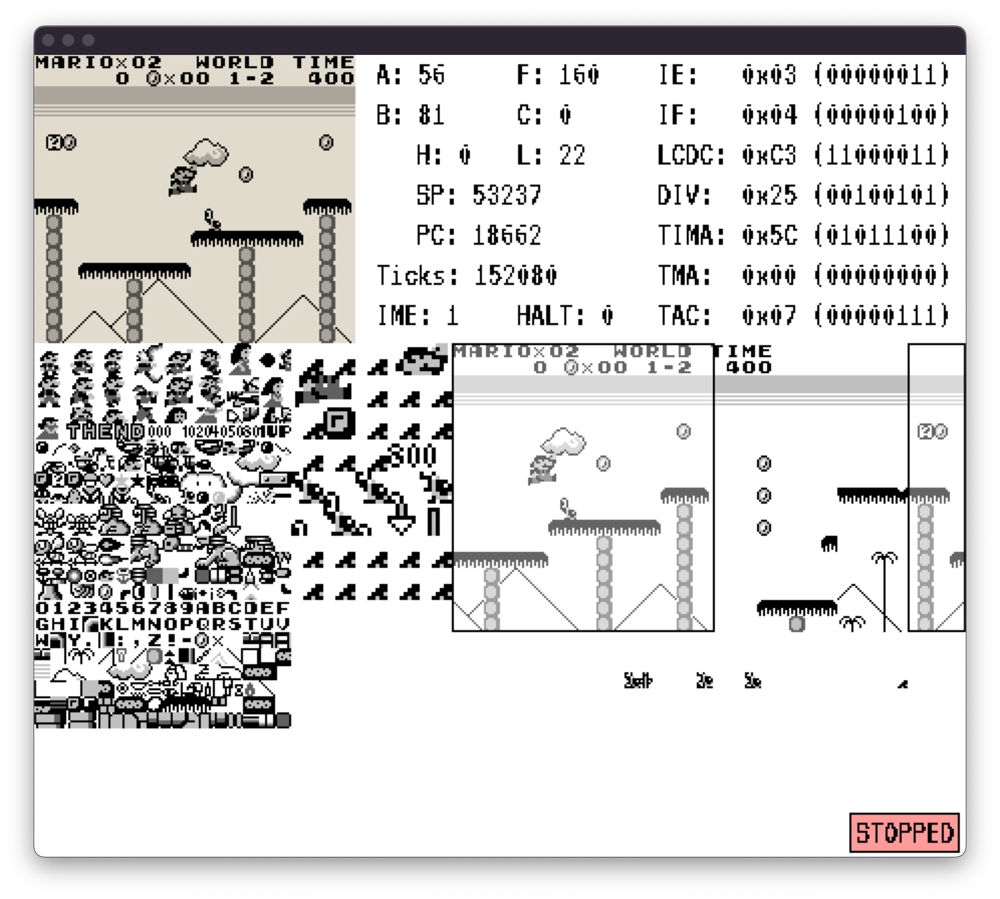
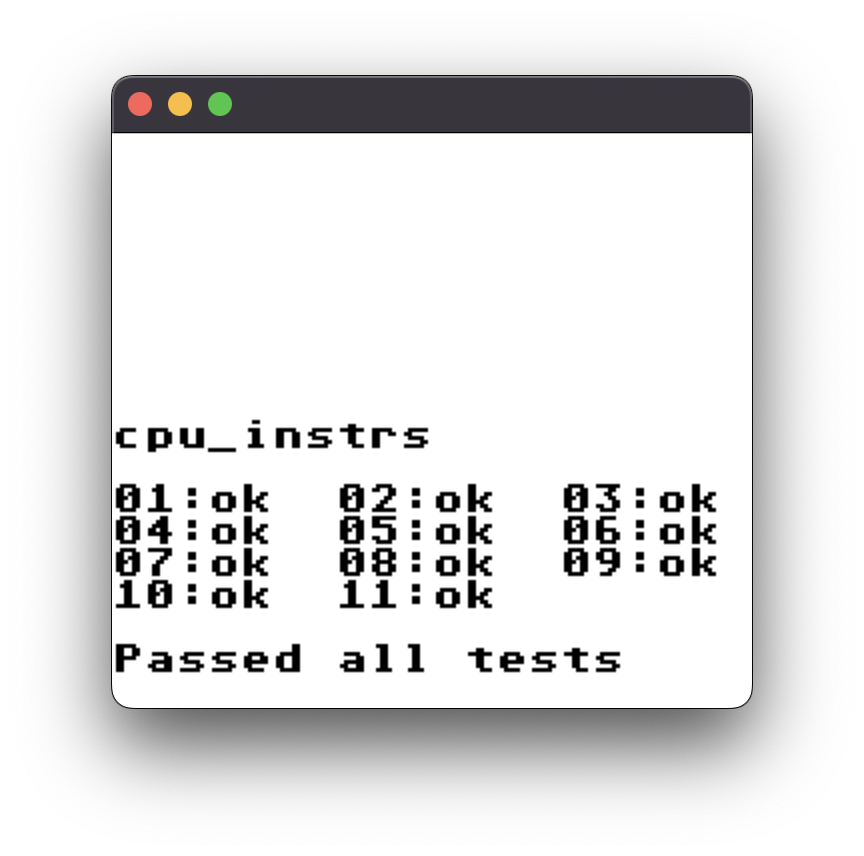
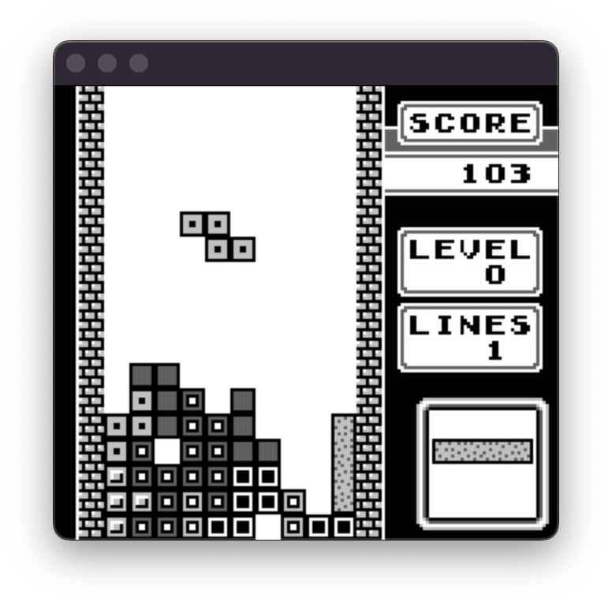
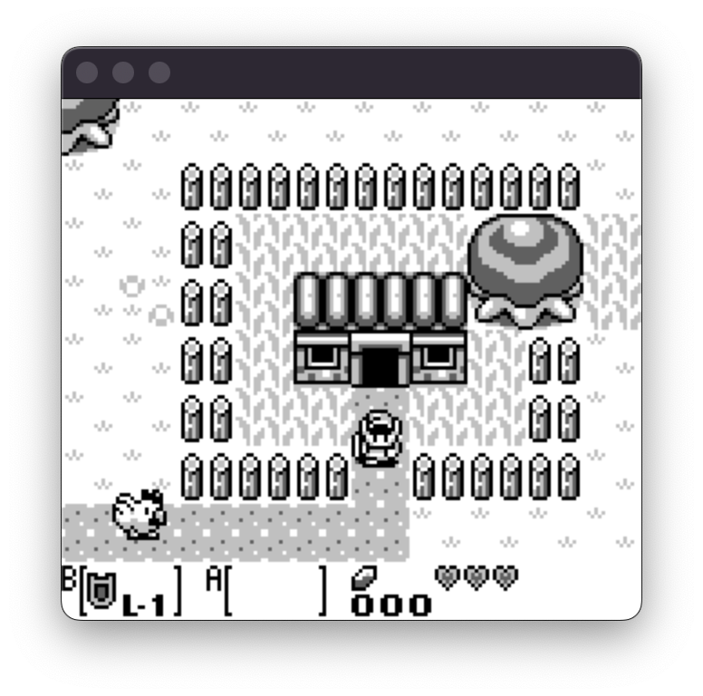
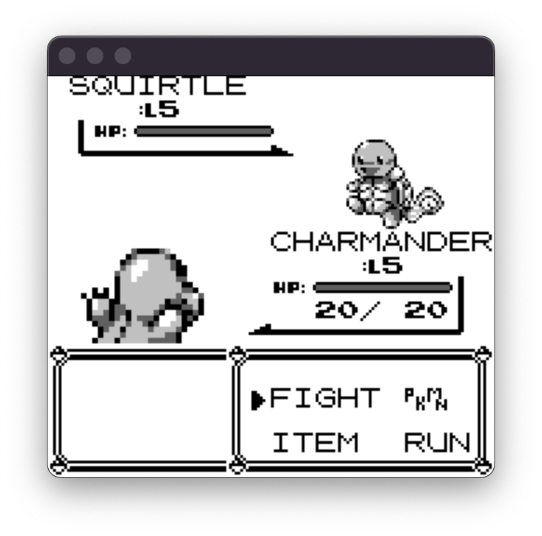
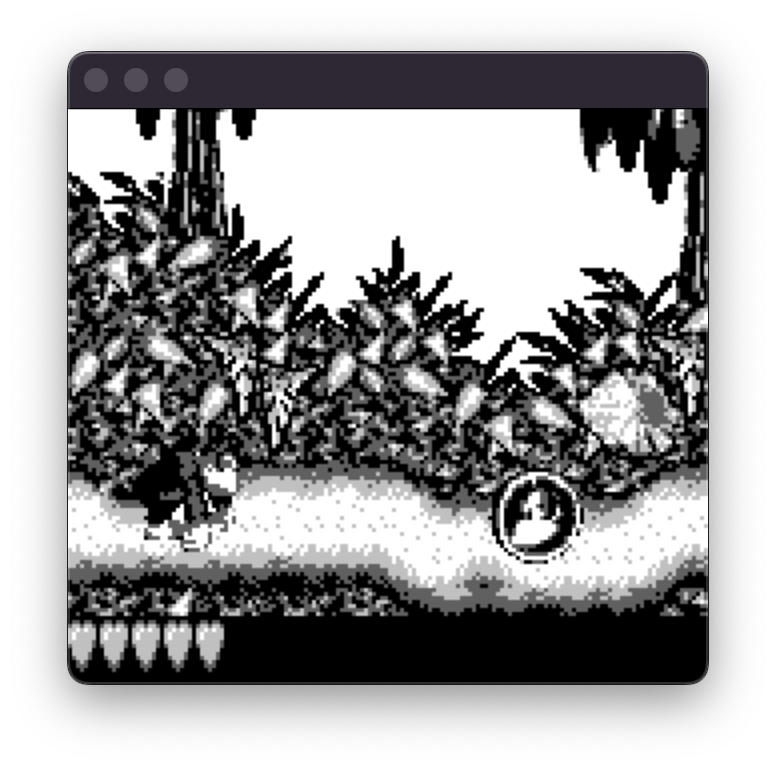
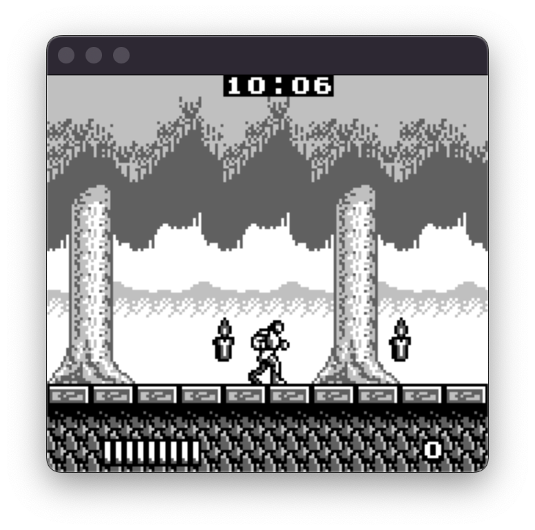
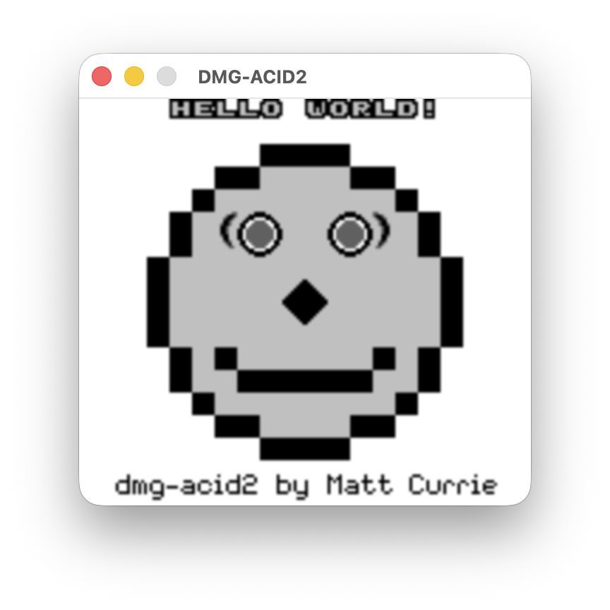

# NoobBoy - GameBoy Emulator

<!-- TEST_BADGES_START -->
     
<!-- TEST_BADGES_END -->

NoobBoy is a simple gameboy emulator that I'm writing to learn more about the world of emulation. This emulator has nothing special and has no extra features compared to other DMG emulators.



## Usage
To build the project, `cmake`, `SDL3` and `SDL3 ttf` are required. The emulator was tested on Linux and MacOS.

### Building
To build the **desktop** version, run the following command in your terminal:
```console
$ make desktop
```
 
### Running
```
usage: ./build/desktop/NoobBoy --rom <rom_file> [--bootrom <bootrom_file>] [--load-save <save_file>] [--debug] [--sound] [--no-bootrom]

arguments:
  --rom                     Standard GameBoy rom
  --bootrom                 Load a custom DMG bootrom
  --debug                   Enable the debugger
  --load-save               Save file to load
  --sound                   Enable experimental sound
  --no-bootrom              Start without bootrom
```


## Input
<table>
<tr><th> Gameplay </th><th>Debug</th></tr>
<tr><td>

| Action | Key |
| --- | --- |
| UP | <kbd>↑</kbd> |
| DOWN | <kbd>↓</kbd> |
| LEFT | <kbd>←</kbd> |
| RIGHT | <kbd>→</kbd> |
| B | <kbd>x</kbd> |
| A | <kbd>z</kbd> |
| START | <kbd>Space</kbd> |
| SELECT | <kbd>Enter</kbd> |
</td><td>

| Action | Key |
| --- | --- |
| Save game | <kbd>s</kbd> |
| Toggle color palette | <kbd>c</kbd> |
| Pause/Resume | <kbd>p</kbd> |
| CPU step | <kbd>n</kbd> |
| Toggle sound | <kbd>m</kbd> |
| Exit | <kbd>Escape</kbd> |

</td></tr> </table>


## Features

- Sound (WIP)
- Correct instructions
- Sprites with correct row limitations
- Correct sprite, window and background pixel priority
- VRAM rendering with X/Y scroll overlay
- Memory Bank Controller (MBC)
- Debug mode
- Save states (dump of external RAM banks)
- Custom bootrom (Based on [ISSOtm/gb-bootroms](https://github.com/ISSOtm/gb-bootroms/) work)

Currently, the `halt bug` is missing because of some incorrect interrupt timings.


## Test Suite

Run the test suite with:

```console
$ make test                                 # run all tests
$ make test SUITE=blargg                    # run one test suite
$ make test SUITE=mooneye/acceptance/timer  # runs one test suite
$ python3 tests/run_tests.py                # run all tests
$ python3 tests/run_tests.py --help         # show all options
```

Results are written to [tests/TESTS.md](tests/TESTS.md) after each run.


## Game Screenshots


|   |   |
|:---:|:---:|
|  |   | 
| *Blargg's CPU Instructions Test* | *Tetris* |
|  |   | 
| *The Legend of Zelda - Link's Awakening* |*Pokemon Blue* |
|  |   | 
| *Donkey Kong Land* |*Castlevania* |
|  |   | 
| *dmg-acid2 Test Rom* |  |


**_NOTE:_**  Some games may not work due to some missing MBC features.
